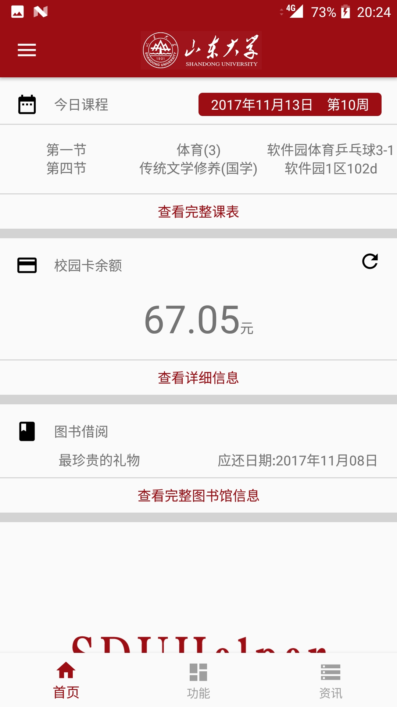
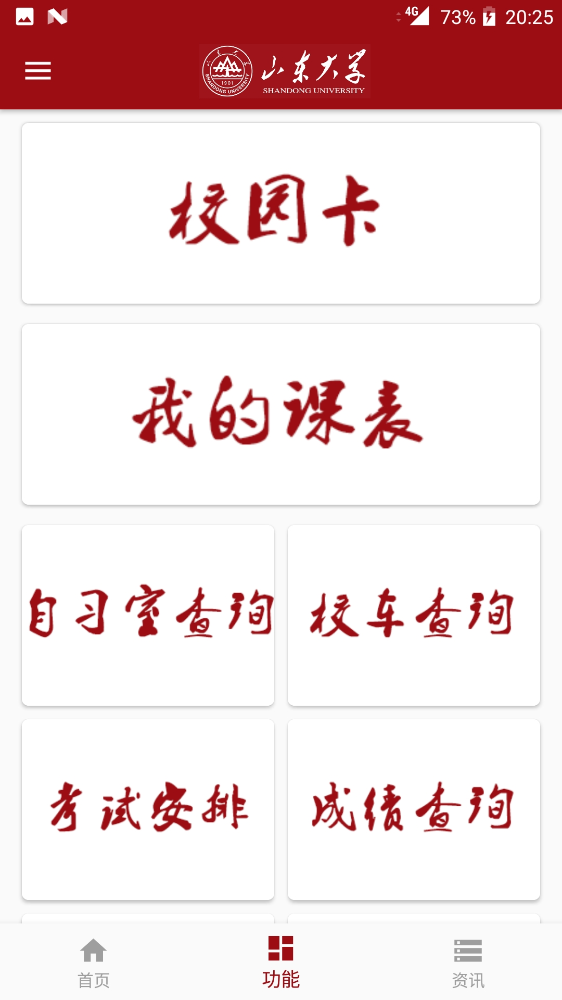
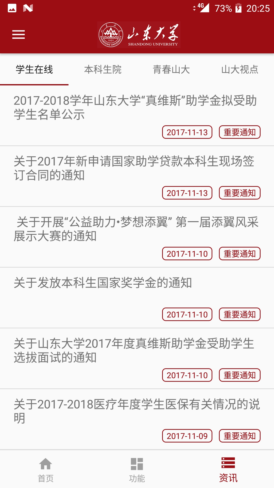

# 山东大学学生在线:SDUHelper

> **山大学子一站式服务平台，您校园生活的贴心助手**

## 说明

出于安全考虑，该项目所有接口信息保存于配置文件中，且该配置文件未上传至GitHub。

## 功能

> 该处信息最后由齐迪更新于2017年10月14日
> > 已完成
> 
> * 课程表
> * 校车查询
> * 图书馆借阅、馆藏查询
> * 成绩、绩点查询  
> * 考试安排查询
> * 校历
> * 山大资讯
> * 校园卡
> * 自习室查询

> > 未完成
> * 无

## 产品截图

| Home    | Functions    | News |
| :-------------: | :-------------: |:-------------: |
|  |  |  | 

## 开发者

* 安卓端开发  
    山东大学2016级 软件 齐迪
* IOS端开发  
    暂无
* 后端开发  
    山东大学2015级 软件 董浩 & 山东大学2015级 机械 唐若钦

## 学生在线简介

    来学生在线，和有意思的人发现更精彩的自己！

> [“学生在线”](https://online.sdu.edu.cn/)是隶属于山东大学党委学工部，始建于2000年，由学生自主开发、运营和维护的大型网络文化工作室。学生在线共设技术工程、应用服务、网络媒体和团队发展四个事业群，包括视觉设计部、web开发部、新媒体运营中心、i山大、行政中心等十四个事业部，现有正式成员四百余人，核心成员一百余人。

>
> > 下设部门
> * 应用服务事业群
> * 网络媒体事业群
> * 技术工程事业群
> * 团队发展事业群
>
> > 主要产品
> * i山大
> * 知道
> * Q小线
> * 山大百科 
 
## 招贤纳士
如果你熟悉IOS开发，希望完成SDUHelper的IOS版本，亦或者你希望在SDUHelper上实现更棒的功能，欢迎加入我们！
> 联系邮箱：[sevenddddddd@gmail.com](mailto:sevenddddddd@gmail.com)  

